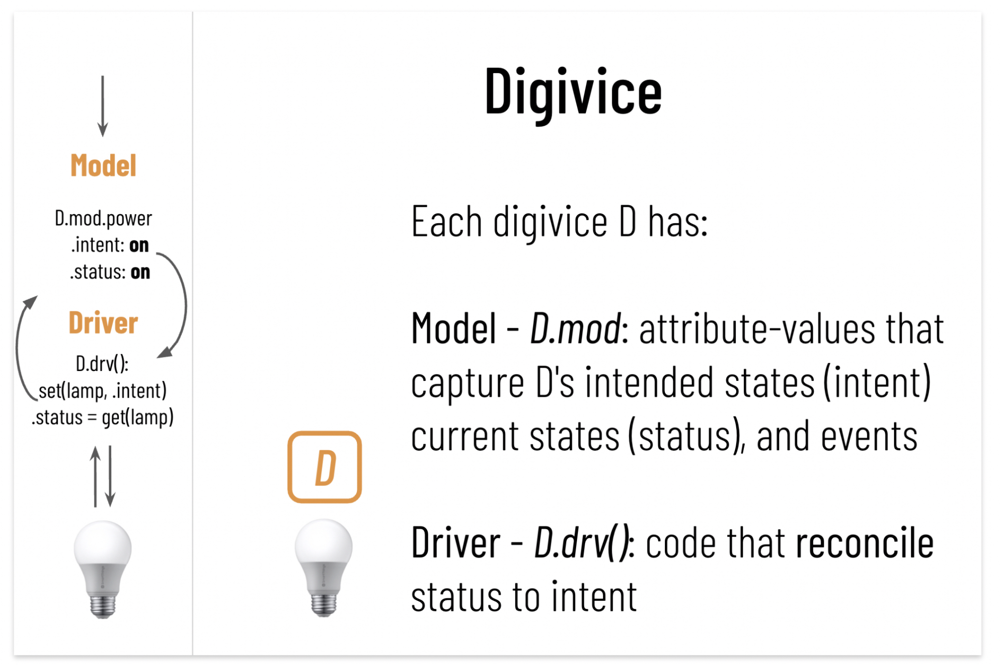

Digi is an open source framework for building lightweight digital twins ("digi") and running them in a cloud-native architecture. Digis are configurable, queryable, and composable.

Digis can run in any infrastructure where Kubernetes runs. They also inherit the nice properties of Kubernetes.

In this demo, we will walk through:

Build a simple Lamp digi
* Build digi 
* Run and configure digi
* Program digi driver

Configure a room that reacts to human presence + analytics
* Compose digis (aggregate room brightness, adapting brightness to human presence)
* What is the average brightness of the lamp? The room?
* TBD lamp count in room
* Who consume the most lamp-time?

### Lamp

```
make demo; cd demo
digi image 
digi init simple-lamp
vi simple-lamp/model.yaml        # add control.power; control.brightness; obs.watt; 
digi gen simple-lamp

vi simple-lamp/deploy/cr.yaml    # add initial values for power as "off"
digi build simple-lamp -q

digi run simple-lamp l1
digi watch l1
digi edit l1	                   # edit power

vi simple-lamp/driver/handler.py # set status to intent for power
```



### Room-presence

> Prior: stop all digis of this demo.

```
cd ../room-presence
digi image

digi run lamp l1
digi edit l1	                   # turn on lamp
digi watch l1
digi edit l1	                   # increase the brightness

digi run room r1 								 # now let's do something fun
digi watch r1										 # brightness, mode
digi space mount l1 r1			    
digi watch r1
digi watch l1
digi edit r1 										 # sleep mode

digi query l1
digi query l1 "head 10"
digi query l1 "select brightness as b where power=='on' | avg(b)"
digi query r1 "head 10"

# TBD
digi run lamp l1 
digi space mount l1 r1
digi query room.lamps "select brightness as b where power=='on' | avg(b)"

# scene
digi run scene s1
digi space mount s1 r1
digi watch r1
digi edit r1										 # adaptive mode
...

# who used the room when the room is in work mode?


# where is the data stored?
digi list                        # lake is a digi; mounter, syncer, policer, piper..digis
digi edit lake 									
digi watch lake

```


```
digi query r1 "select brightness,human | this := crop({brightness:float32,human:[string]}) | explode this by type({brightness:float32,human:string})"
```


### Printer

```
make demo; cd demo
digi image 
digi init printer
vim printer/model.yaml     # add control.power; obs.toner; 
digi gen printer
vim printer/deploy/cr.yaml # add initial values for power
digi build printer
digi watch printer
digi edit printer          # edit power
```

Seeking feedback:
* Use cases
* Better demo